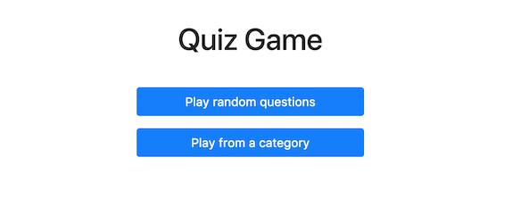

# Quiz Game

Great, your environment is now working! If that's not the case, read again the main [README](../README.md) and feel free to ask me for help! 

Now, you should be reading this on the url http://localhost:8000/Step02/. The interface you are seeing is powered by Elm Reactor, a tool to quickly have a dev environment started. The only drawback is that it does not handle auto-refresh, and you'll have to refresh yourself to see changes.

The goal of this workshop is to create a quiz game based on the Trivia API. A few questions are retrieved from the API and the user can answer to them. A working version can be found here: https://trivia-game.surge.sh/

Step by step, we will discover the Elm language by implementing this web application. 

**Let's start!**

## Objectif

In this first step, we will create the homepage. As you can see below, it should contain a title and two buttons.



Here is the HTML structure you should match in order to pass the tests:

```html
<div class="gameOptions">
    <h1>Quiz Game</h1>
    
    <a class="btn btn-primary" href="#game">
        Play random questions
    </a>
    
    <a class="btn btn-primary" href="#categories">
        Play from a category
    </a>
</div>
```

You can now open the file `./HomePage.elm` in your IDE and start coding to make your tests pass. They should be quite explicit about what is expected, take some time to read them!


## In Elm, HTML is, well... Elm code!

To display HTML in Elm, you will use standard Elm functions imported from a module called `Html`. As you can see, some of these functions are imported at the top of the file:

```elm
import Html exposing (Html, a, div, h1, text)
```

You can then use them that way:

```elm
div [] []
```

As you can see, the function `div` takes two arguments that are two lists. 
 
The first list contains the HTML attributes you want to set on your `div` tag, for example an `id`, a `class`, ...

The second list contains the children / content of your div element. Remember that a HTML file is a tree where tags contain other tags. 

To help you assimilate these notions, here are a few examples and their resulting HTML:

```elm
div [ class "myClass" ] []
-- <div class="myClass"></div>


div [] [ text "content of my div" ]
-- <div>content of my div</div>


div [] [ h1 [] [ text "a title inside a div" ] ]
-- <div><h1>a title inside a div</h1></div>


div [ id "myId" ] 
    [ span [] [ text "two spans inside" ]
    , span [] [ text "a parent div" ]
    ]
-- <div id="myId">
--   <span>two spans inside</span>
--   <span>a parent div</span>
-- </div>

```

It's now your turn, good luck!


## Let's start!
[Click here to view the result of your file in the browser](./HomePage.elm) (don't forget to **refresh** the page after changes!)


Once the tests are passing, you can go to the [next step](../Step02).