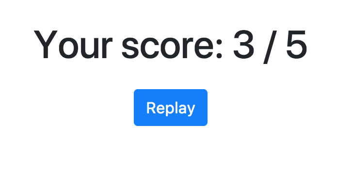

# Step 2: Results Page!

## Goal

We will now create the results page. This is a really simple one but it will allow us to see some new notions.



Below you can see the HTML structure that is expected:

```html
<div class="score">
    <h1>Your score: 3 / 5</h1>
    <a class="btn btn-primary" href="#">Replay</a>
</div>
```

Be careful, the value won't always be `3`, it is given through an argument to your function.

You can now open in your IDE the file `./ResultPage.elm` and start to code!


## Some hints

Be careful, this time all the imports needed are not done, you will need to add some functions to the imports lists at the beginning of the file! No surprise, the names are the same than the tags you want to use in HTML!

```elm
-- Add your imports below
import Html exposing (Html, div, text) 
-- Add the attributes you need below
import Html.Attributes exposing (class)
```

As we've said before, you will need to use the argument `score` given to your function `resultPage`. This is an `Int` and you will need to convert it to a `String` to display it. 

Maybe you can find a helpful function [on this page](https://package.elm-lang.org/packages/elm/core/latest/String). (*There is no need to import the module `Basics`, it's already imported by default in your Elm programs.*)


## Let's start!
[See the result of your code](./ResultPage.elm) (don't forget to refresh to see changes)


Once the tests are passing, you can go to the [next step](../Step03).
