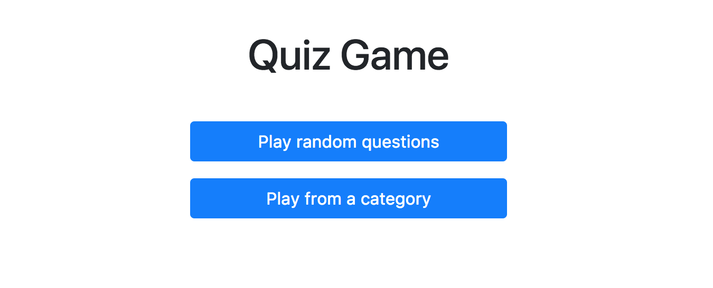

# Quiz Game

L'objectif de ce workshop est de réaliser une petite application web de quiz. Étape par étape, nous allons réaliser ce petit jeu avec des fonctionnalités de base, passant en revue les éléments du langage Elm.

Vous pouvez voir le rendu de l'application que nous allons réaliser ici: [https://trivia-game.surge.sh](https://trivia-game.surge.sh) 


## Objectif

Dans cette étape 2, nous allons réaliser l'apparence de la page d'accueil. Comme vous pouvez le voir sur le screen ci-dessous, celle-ci contient un titre et deux boutons.



Voici la structure que vous devez réaliser en HTML:

```html
<div class="gameOptions">
    <h1>Quiz Game</h1>
    
    <a class="btn btn-primary" href="#game">
        Play random questions
    </a>
    
    <a class="btn btn-primary" href="#categories">
        Play from a category
    </a>
</div>
```

Pour cela, ouvrez le fichier `./HomePage.elm` dans votre IDE et commencez à bidouiller le code pour obtenir le rendu désiré !

Des tests vous guideront pour obtenir le résultat désiré.


## En Elm, le HTML... c'est du Elm !

Pour ça on utilise des fonctions contenues dans un module `Html`. Comme vous pouvez le voir, elles sont importées au début du fichier `HomePage.elm` :

```elm
import Html exposing (Html, beginnerProgram, a, div, h1, text)
```

Vous pouvez ensuite utiliser les fonctions de la façon suivante : 

```elm
div [] []

```

Comme vous pouvez le voir, une fonction HTML possède généralement deux arguments. Le premier correspondant aux différents attributs de votre balise, et le second au contenu de votre balise. Voici quelques exemples :

```elm
div [ class "myClass" ] []

div [] [ text "content of my div" ]

div [] [ div [] [ text "another div inside the first one" ] ]

div [] 
    [ span [] [ text "two spans inside" ]
    , span [] [ text "a parent div" ]
    ]
```

A vous de jouer, utilisez les différentes fonctions à votre disposition pour générer le HTML attendu !


## Let's start!
[Lien vers le rendu](./index.html) (pensez à actualiser)


<div style="text-align: right;"><a href="../Step03">Étape suivante --&gt;</a></div>