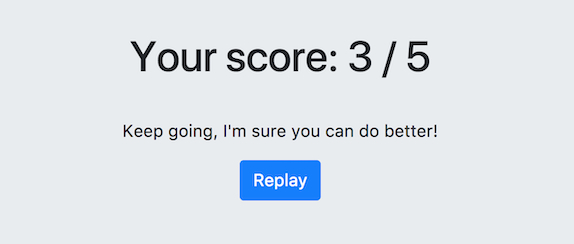

# Step 3: Let's go further with the results page!

## Goal

This results page is a bit too static to my tastes. It would be nice to display a comment depending on the score! For example:



Here is the HTML you'll need to produce:

```html
<div class="score">
    <h1>Your score: 3 / 5</h1>
    <p>Keep going, I'm sure you can do better!</p>
    <a class="btn btn-primary" href="#">Replay</a>
</div>
```

To do so, open the file [`./ResultPage.elm`](./ResultPage.elm) and add what's missing! We want to choose between these two comments depending on the score:

 - If the score is comprised between 0 and 3 (included), display: `Keep going, I'm sure you can do better!`
 - Else, display: `Congrats, this is really good!`
 
 Be careful to copy/paste the exact same phrases, the tests are pretty strict ;-)


## Let's start!
[See the result of your code](./ResultPage.elm) (don't forget to refresh to see changes)


Once the tests are passing, you can go to the [next step](../Step04).