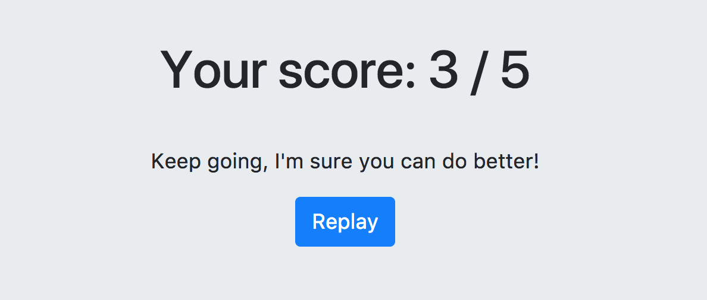

# Étape 4 : Allons plus loin avec la page de résultat

## Objectif

Cette page de résultat est un peu trop statique, ce serait bien d'avoir un commentaire dépendant du score ! 



Voici la structure que vous devez réaliser en HTML :

```html
<div class="score">
    <h1>Your score: 3 / 5</h1>
    <p>Keep going, I'm sure you can do better!</p>
    <a class="btn btn-primary" href="#">Replay</a>
</div>
```

Pour cela, ouvrez le fichier `./ResultPage.elm` et ajoutez ce qu'il manque ! On veut deux commentaires différents :

 - Si le score est compris entre 0 et 3, afficher "Keep going, I'm sure you can do better!"
 - Sinon, afficher "Congrats, this is really good!"


## Un bloc `let...in` pour déclarer des variables

En ouvrant le fichier, vous allez voir une nouveauté, un bloc `let...in`. Celui-ci vous permet de déclarer des variables dans le bloc `let` pour les utiliser ensuite dans le bloc `in`:

```elm
import Html exposing (text)

displayResult userAnswer correctAnswer =
    let
        message = 
            if userAnswer == correctAnswer then 
                "Correct!" 
            else 
                "Wrong!"
    in 
        text message
```

En général, cela permet d'avoir un code plus lisible.


## Let's start!
[Lien vers le rendu](./index.html) (pensez à actualiser pour voir vos changements)


<div style="text-align: right;"><a href="../Step05">Étape suivante --&gt;</a></div>