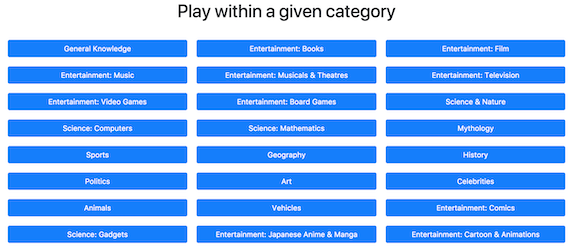

# Step5: Categories list (part 2)

## Goal

Now that we've created our `Category` type, let's display this list of categories! 



The expected HTML structure is the following one: 

```html
<div>
    <h1>Play within a given category</h1>
    <ul class="categories">
        <li>
            <a class="btn btn-primary" href="#game/category/9">
                General Knowledge
            </a>
        </li>
        <!-- ... -->
        <li>
            <a class="btn btn-primary" href="#game/category/32">
                Entertainment: Cartoon &amp; Animations
            </a>
        </li>
   </ul>
</div>
```

We've already displayed HTML a few times, but here let's consider that we don't know the number of categories, which is why we cannot display them one by one with 24 lines of code.

Your spider/developer sense must be tingling! *We need a loop!* But wait... Elm don't have loops! 😱 

However, it is a functional programming language so we have access to some operations we can use on lists to transform them.

When you think about it, it's exactly what we cant to do: transform our list of `Category` into a list of HTML elements: a `li` that represents a category.

Once this list is transformed, we can directly use it as the second argument of a `ul` function to have the expected result (remember that the second argument of a HTML function is a list of HTML elements!) 

The function that will help use transform the list is `List.map` and you can [find its documentation there](http://package.elm-lang.org/packages/elm-lang/core/latest/List#map). As you can see, `List.map` takes two arguments: the first one is a function that will transform a single element of the list, and the second argument is the list itself:

```elm
numbers : Int
numbers = 
    [1, 2, 3, 4, 5]

toSquare : Int -> Int
toSquare number =
    number * number
    
-- Contains [1, 4, 9, 16, 25]
squaredNumbers : Int
squaredNumbers = 
    List.map toSquare numbers 
``` 
 

## Let's start!

[See the result of your code](./CategoriesPage.elm) (don't forget to refresh to see changes)

Once the tests are passing, you can go to the [next step](../Step06).