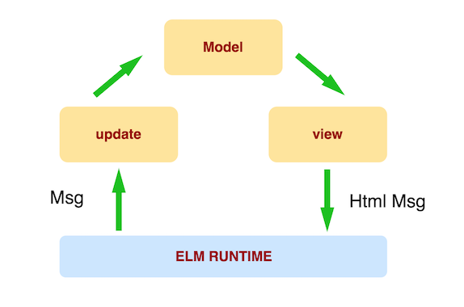

# Step 6: The Elm Architecture

## Goal

Let's take a break from the categories page and talk about *The Elm Architecture (TEA)*. Be prepared, there is a lot to read for this step, but it's for your own good! 😄

After having developed many web apps, the Elm developers have found a really simple and efficient pattern to build their applications and it was standardized under the name `The Elm Architecture`.

A web app in Elm is constituted of three elements:

 - a `model`, containing the application state
 - a `view` function that is responsible for rendering the HTML from the `model` ; this HTML can emit _messages_ to update the state
 - a `update` function, that will receive emitted _messages_ and the current `model` and is responsible for updating the model
 
The only place where you can change your state is the `update` function. The only place where you can display something is from the `view` function. Every value of your state should live in the global `model`
 
The workflow of an Elm application is the following:

 - We create an application by providing the initial model, a `view` and a `update` function
 - The `view` function is called with the `model` as only argument and produces the HTML view 
 - An event is triggered that generates a _message_ (user click, timer, HTTP request finished, ...)
 - This _message_ is given to the `update` function along with the current `state`, the function returns the new updated `model`
 - The `view` function generates the new HTML view accoring to this new `model`
 


## The Counter

Let's see how this works with a simple counter. [You can find the working example online.](https://ellie-app.com/37gVmD7Tm9Ma1) Here is the commented code for you to analyze each element: 

```elm
module Counter exposing (..)

import Browser
import Html exposing (Html, button, span, text, div)
import Html.Events exposing (onClick)


-- Here we declare app through the function `Browser.sandbox` with an initial model (the Int `O`), 
-- a `view` function and an `update` fonction
main =
    Browser.sandbox { init = 0, view = view, update = update }

-- Here we are creating a union type representing all the messages
-- our application can receive
type Msg
    = Increment
    | Decrement 


-- The update function take a message and a model as arguments 
-- to return the new model
update msg model =
    case msg of
        Increment ->
            model + 1

        Decrement ->
            model - 1


-- The view function just create the proper HTML according 
-- to the model
view model =
    div []
        [ button [ onClick Decrement ] [ text "-" ]
        , span [] [ text (toString model) ]
        -- Thanks to `onClick` we can generate a message when 
        -- the user clicks on this button
        , button [ onClick Increment ] [ text "+" ]
        ]
```


## Let's practice!

Before setting up this architecture on the categories page, let's try it with a slightly easier example. We will build a page asking if the user is underage or not, and then display a message accordingly.


A working example [can be found there](https://underage-or-adult.surge.sh/).


### Model 

Our model will only contain a single value, which is the only data we need: the user choice.

However, at loading, the user haven't done any choice, so this value can be undefined. We could make the choice to have a default value, but the goal is to only display the message once the user has made a choice.

In JavaScript, we could solve this problem with the use of a `null` or `undefined` value... And by making possible these kinds of errors:

```js
const user = null;
user.name;
// VM245:1 Uncaught TypeError: Cannot read property 'name' of null

let myFunction = undefined;
myFunction();
// Uncaught TypeError: myFunction is not a function
``` 

It's really difficult with JavaScript to not have these errors in production, because of the dynamic nature of the language. Elm has decided to avoid having `null` or `undefined`. 

Then how do we represent an empty value? We can do that by using a [union type](https://guide.elm-lang.org/types/union_types.html) `UserStatus` that can have three values: `NotSpecified`, `UnderAge` and `Adult`. The advantage here is that the compiler will force you to handle every possible cases!

With the help of a `case...of` (we've already seen it within the counter example) nwe can then display a message according to the value. A little example below on another use case:

```elm 
type ShirtSize = Large | Medium | Small

displayShirtSize : ShirtSize -> Html Msg
displayShirtSize size = 
    case size of
        Large -> 
            text "Large size"
        Medium ->
            text "Medium size"
        Small ->
            text "Small size"
```


### Messages

A [union type](https://guide.elm-lang.org/types/union_types.html) `Msg` is defined and already contains the only message we need: `UserStatusSelected`, that takes a `UserStatus` as argument, which is another union type that is defined in the code.


## Update and View

These two functions are already created, but they will need a few changes to get it working. For example, the change function does not currently update the state, because it always return the same value! Change this to make the tests pass!


## Let's start!

[See the result of your code](./UserStatus.elm) (don't forget to refresh to see changes)

Once the tests are passing, you can go to the [next step](../Step07).