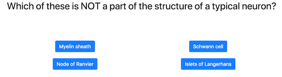

# Step 12: Game page

## Goal

Our quiz game can display the home page, the list of categories, the result page, but we can't even display questions! Let's do that!



Here is the HTML code you need to have:

```html
<div>
    <h2 class="question">Question here</h2>
    <ul class="answers">
        <li><a class="btn btn-primary">Answer 1</a></li>
        <li><a class="btn btn-primary">Answer 2</a></li>
        <li><a class="btn btn-primary">Answer 3</a></li>
        <li><a class="btn btn-primary">Answer 4</a></li>
    </ul>
</div>
```

Everything is static for now, we will add the logic in the next steps. 
 

## Let's start!

[See the result of your code](./GamePage.elm) (don't forget to refresh to see changes)

Once the tests are passing, you can go to the [next step](../Step13).

